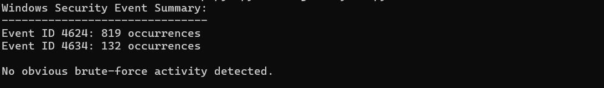

# Security Log Analysis Using Python

## Overview
This project demonstrates how Python can be used by SOC analysts to analyze Windows Security Event Logs and identify suspicious authentication behavior such as repeated failed login attempts that may indicate brute-force attacks.

The project simulates a real-world SOC scenario where automation is used to reduce manual log review and speed up alert triage.

---

## Project Objective
To analyze Windows Security Event Logs using Python and apply basic detection logic to identify abnormal authentication patterns relevant to SOC investigations.

---

## Data Collection
Windows Security Event Logs were generated on a personal test system by performing login and logoff activities.  
These logs were exported from Windows Event Viewer into CSV format for offline analysis using Python.

The exported log data included:
- Event ID
- Timestamp
- Account name
- Logon type

---

## Tools and Technologies Used
- Operating System: Windows  
- Programming Language: Python  
- Log Source: Windows Security Event Logs (CSV format)

### Python Libraries
- csv – used for reading and parsing log files  
- collections – used for counting event occurrences  

---

## Python Script Overview
A Python script was written to parse the exported Windows Security logs and count authentication-related Event IDs.

### Python Code
```python
import csv
from collections import Counter

log_file = "security_logs.csv"
event_counts = Counter()

with open(log_file, newline='', encoding="utf-8", errors="ignore") as file:
reader = csv.DictReader(file)
for row in reader:
event_id = row.get("Event ID")
if event_id:
event_counts[event_id] += 1

print("Event ID Analysis:")
for event, count in event_counts.items():
print(f"Event ID {event}: {count} occurrences")

``` 

## Event IDs Analyzed
The analysis focused on common Windows authentication-related Event IDs:
- 4624 – Successful logon  
- 4625 – Failed logon  
- 4634 – Logoff  

Monitoring these Event IDs helps SOC analysts understand authentication behavior and identify potential attack patterns.

## Detection Logic
The following logic was used to identify suspicious activity:
- Multiple failed login attempts within a short time window  
- High number of failed logons compared to successful logons  

Such patterns may indicate brute-force attacks or unauthorized access attempts.

## Output and Findings

The script outputs the total count of each authentication-related Event ID. This provides quick visibility into authentication trends and allows SOC analysts to identify abnormal behavior efficiently.

Repeated failed login attempts were clearly visible through event frequency analysis.

## Error Handling and Troubleshooting
Common issues handled during analysis included:
- Encoding errors in CSV files  
- Incorrect file paths  
- Missing or malformed log entries  

Encoding issues were handled using UTF-8 with error ignoring to prevent script failure.

## Security and Privacy Considerations
- Logs analyzed belong to a personal test environment  
- No sensitive or personally identifiable information (PII) was exposed  
- This project is shared strictly for educational and demonstration purposes  

## SOC Use Case
This project demonstrates how SOC analysts can use Python automation to:
- Reduce manual log review  
- Quickly identify suspicious authentication behavior  
- Support faster alert triage and escalation decisions  

## Conclusion
This project highlights the effectiveness of Python automation in SOC environments by demonstrating how Windows Security Event Logs can be analyzed efficiently to detect suspicious authentication activity and support timely security investigations.


